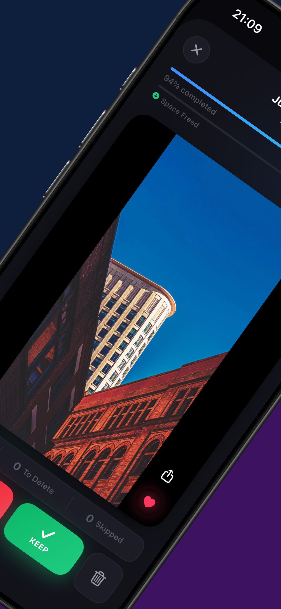
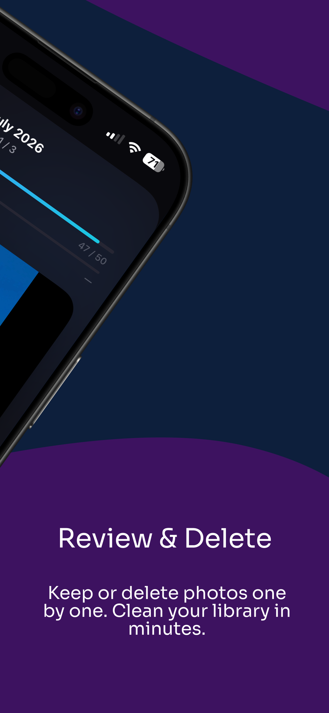
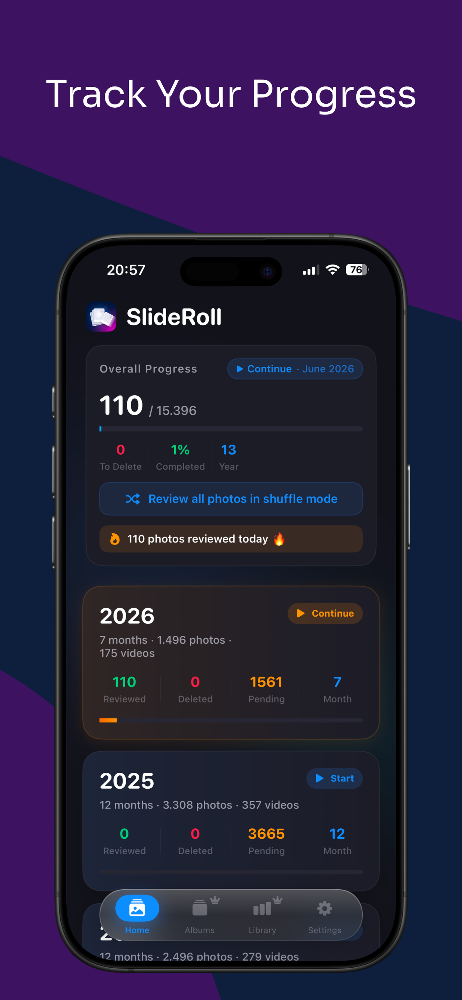
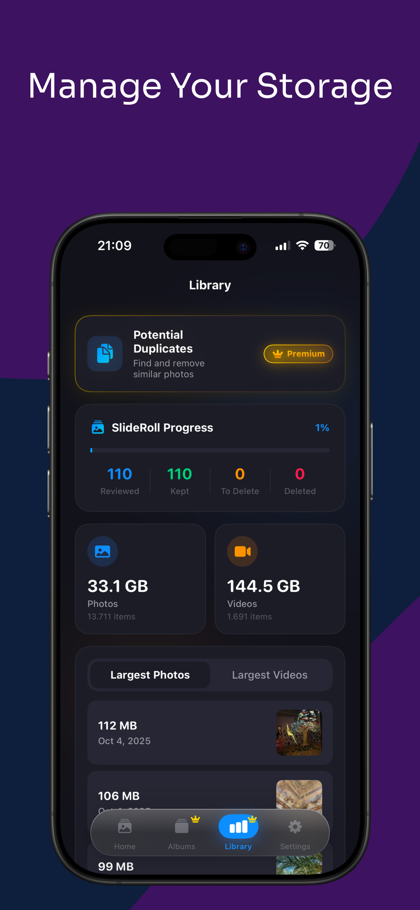
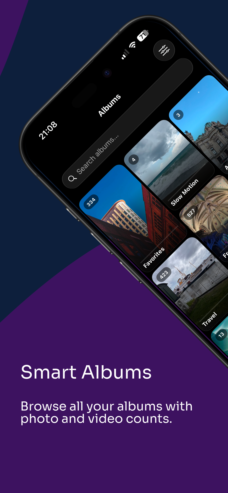
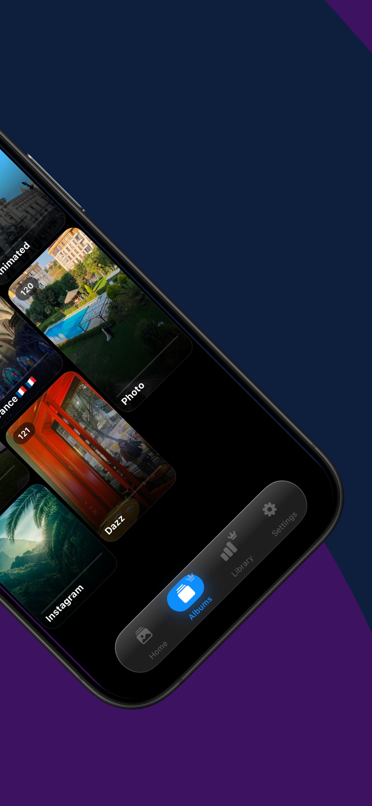
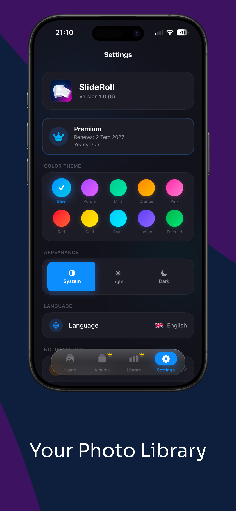

# SlideRoll - Photo Cleaner

**SlideRoll**, iPhone'unuzdaki fotoğraf kütüphanesini hızlı, basit ve keyifli bir şekilde temizlemenizi sağlayan bir iOS uygulamasıdır.

> 📲 **[App Store'dan İndir](https://apps.apple.com/tr/app/slideroll-photo-cleaner/id6783137235?l=tr)**

---

## Ekran Görüntüleri

  
  
  
  
  

  
  
  
  
  

---

## Özellikler

- **Kaydırma ile İnceleme** — Sağa kaydır: tut, Sola kaydır: sil, Yukarı kaydır: sonraya bırak
- **Akıllı Albümler** — Selfie, Video, Panorama, Ekran Görüntüsü, Favori ve daha fazlası
- **Kopya Tespiti** — Neredeyse aynı fotoğrafları otomatik olarak bulur ve gruplar
- **Aylık İnceleme** — Fotoğraflar yıl ve aya göre gruplandırılır
- **İlerleme Takibi** — Kaç fotoğraf incelediğini ve ne kadar alan kazandığını görürsün
- **Kütüphane İçgörüleri** — Depolama dağılımı, en büyük dosyalar, istatistikler
- **Çöp Merkezi** — İşaretlenen fotoğrafları toplu ve güvenli şekilde sil
- **Karışık Mod** — Tüm kütüphaneyi rastgele sırayla incele
- **Yerleşik Zoom** — 4x'e kadar sıkıştır-zum yap
- **Premium** — Sınırsız kaydırma, tüm albümler, öncelikli kopya tarama
- **12 Dil Desteği** — Türkçe, İngilizce, Almanca, İspanyolca ve daha fazlası
- **5 Renk Teması** — Mavi, Mor, Mint, Turuncu, Pembe
- **Dark / Light Mode** — Sistem temasına otomatik uyum
- **Tamamen Cihaz Üzerinde** — Hesap yok, yükleme yok, takip yok

---

## Nasıl Kullanılır

1. Uygulamayı açın ve fotoğraf erişim izni verin
2. Ana ekrandan yıl → ay seçin veya albümlere göz atın
3. Fotoğrafları kaydırarak değerlendirin:
   - **→ Sağ:** Tut
   - **← Sol:** Sil
   - **↑ Yukarı:** Sonraya bırak
4. Çöp Merkezi'nden fotoğrafları kalıcı olarak silin

---

## Teknoloji

- **SwiftUI** — Tüm arayüz
- **PhotoKit** — Fotoğraf erişimi, silme, favori
- **StoreKit 2** — Abonelik sistemi
- **Google Mobile Ads** — Reklam entegrasyonu
- **AVKit** — Video oynatma
- **Swift Observation (@Observable)** — State yönetimi
- **UserDefaults** — İlerleme ve ayar kalıcılığı

---

## Geliştirici

**Mert Kerimi** — [@mertkerimi](https://github.com/mertkerimi)

---

## Lisans ve Telif Hakkı

© 2026 Mert Kerimi. Tüm hakları saklıdır.

Bu repo yalnızca inceleme amaçlıdır. Kaynak kod, görseller ve uygulama içeriği izinsiz kopyalanamaz, dağıtılamaz veya ticari amaçla kullanılamaz.

Uygulamayı kullanmak için [App Store'dan indirin](https://apps.apple.com/tr/app/slideroll-photo-cleaner/id6783137235?l=tr).
