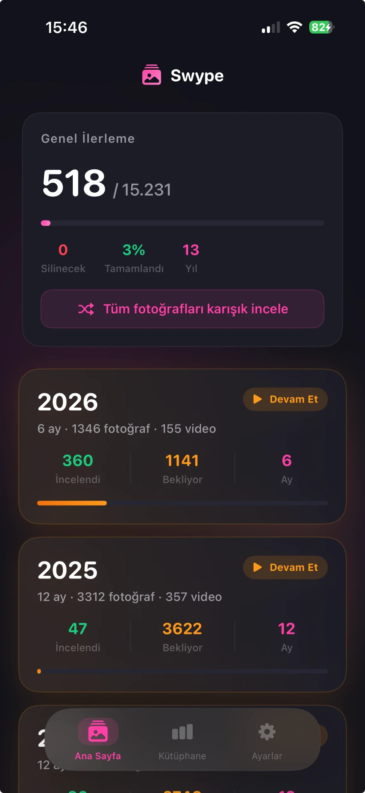
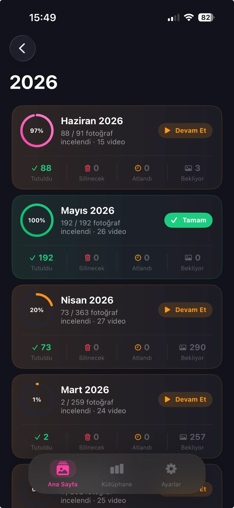
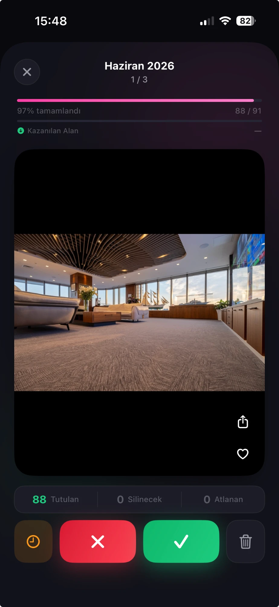

# Swype 📸

**Swype**, iPhone'unuzdaki binlerce fotoğrafı hızlıca temizlemenizi sağlayan bir iOS uygulamasıdır. Tinder'dan ilham alan kart kaydırma sistemiyle fotoğraflarınızı kolayca yönetin.

---

## Ekran Görüntüleri

<p align="center">
  
  
  
</p>

<p align="center">
  <em>Ana Ekran &nbsp;&nbsp;&nbsp;&nbsp;&nbsp;&nbsp;&nbsp;&nbsp;&nbsp;&nbsp;&nbsp;&nbsp;&nbsp;&nbsp;&nbsp;&nbsp; Ay Listesi &nbsp;&nbsp;&nbsp;&nbsp;&nbsp;&nbsp;&nbsp;&nbsp;&nbsp;&nbsp;&nbsp;&nbsp;&nbsp;&nbsp;&nbsp;&nbsp; Kart İnceleme</em>
</p>

---

## Özellikler

- **Kart Kaydırma** — Sağa: tut, Sola: sil, Yukarı: sonraya bırak
- **Yıl & Ay Grupları** — Fotoğraflar otomatik olarak yıl ve aya göre gruplandırılır
- **İlerleme Takibi** — Yıl ve ay bazında detaylı inceleme istatistikleri
- **Karışık İnceleme** — Tüm fotoğrafları karışık sırayla incele
- **Zoom** — 2 parmakla 4x'e kadar zoom; fotoğrafa dokun → geri al
- **Alan Tasarrufu Çubuğu** — İnceleme ekranında anlık kazanılan alan gösterimi
- **Kütüphane İstatistikleri** — Depolama dağılımı, en büyük fotoğraflar, yıllık grafik
- **Silinecekler Merkezi** — İşaretlenen fotoğrafları toplu yönet ve kalıcı sil
- **Çok Dil** — Türkçe, İngilizce, Almanca
- **5 Renk Teması** — Mavi, Mor, Mint, Turuncu, Pembe
- **Dark / Light Mode** — Sistem temasına otomatik uyum
- **Kalıcı İlerleme** — Uygulamayı kapatsanız bile kaldığınız yerden devam

---

## Kurulum

1. Repoyu klonlayın:
   ```bash
   git clone https://github.com/mertkerimi/Swype.git
   ```
2. `Swype.xcodeproj` dosyasını Xcode ile açın
3. Gerçek bir iPhone'a veya simülatöre build edin (`⌘R`)
4. Fotoğraflar iznini verin ve kullanmaya başlayın

**Gereksinimler:** Xcode 26+, iOS 18+, Swift 6

---

## Nasıl Kullanılır

1. Uygulamayı açın ve fotoğraflara erişim izni verin
2. Ana ekrandan yıl → ay seçin
3. Fotoğrafları kaydırarak veya butonlarla değerlendirin:
   - **→ Sağ / ✓:** Tut
   - **← Sol / ✗:** Sil
   - **↑ Yukarı / ⏰:** Sonraya bırak
   - **Fotoğrafa dokun:** Son kararı geri al
4. Silinecekler ekranından fotoğrafları kalıcı olarak silin

---

## Teknoloji

- **SwiftUI** — Tüm arayüz
- **Photos Framework** — Fotoğraf erişimi, silme, favori
- **PHCachingImageManager** — Performanslı görsel yükleme
- **AVKit** — Video oynatma
- **Swift Observation (@Observable)** — State yönetimi
- **UserDefaults** — İlerleme ve ayar kalıcılığı

---

## Geliştirici

**Mert Kerimi** — [@mertkerimi](https://github.com/mertkerimi)

---

## Lisans

MIT License — dilediğiniz gibi kullanabilirsiniz.
